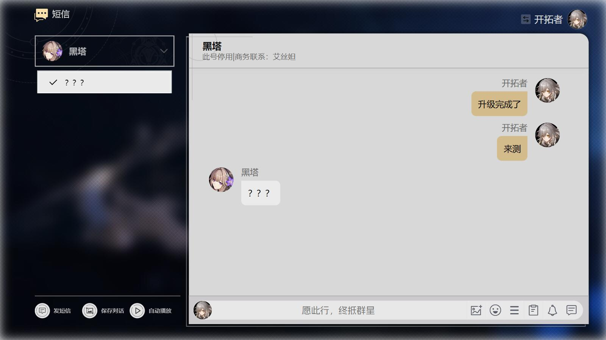

<h1 align="center">星穹铁道短信生成器</h1>

<h4 align="center">
  <a href="https://sr.shenmedouyou.top">https://sr.shenmedouyou.top</a>
</h4>

## 功能

- [x] 自动播放
- [x] 绿幕背景
- [x] 男女主切换
- [x] 自定义头像
- [x] 自定义角色
- [x] 表情包
- [ ] 自定义表情包
- [x] 通知信息
- [x] 图片消息
- [x] 图片剪裁
- [x] 任务消息
- [x] 回复选项
- [x] 对话气泡
- [x] 数据导出导入

## TODO

- [ ] 图片使用 SVG 重绘
- [ ] 统一图标风格
- [x] 对话页面没滚动到最底的时候滚动提示
- [x] 板鸭土味表情包
- [x] 消息加载动画时间跟长度正相关
- [x] 已发送图片修改
- [ ] 表情回复选项
- [x] 单独的设置页
- [ ] 对话预览底部分割线

## 素材来源

<table>
  <tr>
    <td>
      <b>素材</b>
    </td>
    <td>
      <b>来源</b>
    </td>
    <td><b>备注</b></td>
  </tr>
  <tr>
    <td>角色卡片</td>
    <td>
      <a href="https://www.miyoushe.com/sr/">米游社</a>
    </td>
    <td rowspan="3">素材版权为米哈游所有</td>
  </tr>
  <tr>
    <td>表情</td>
    <td>
      <a href="https://www.miyoushe.com/sr/">米游社</a> ·
      <a href="https://wiki.biligame.com/sr/">星穹铁道BWiki</a>
    </td>
  </tr>
  <tr>
    <td>角色头像</td>
    <td><a href="https://wiki.biligame.com/sr/">星穹铁道BWiki</a></td>
  </tr>
  <tr>
    <td>图标</td>
    <td>
      <a href="https://www.iconfont.cn/">Iconfont</a>
    </td>
    <td>部分</td>
  </tr>
  <tr>
    <td>字体</td>
    <td>
      <a href="https://fonts.google.com/">GoogleFont</a>
    </td>
    <td>
      <a href="https://fonts.google.com/noto/specimen/Noto+Sans+SC">NotoSans</a>
    </td>
  </tr>
</table>

## 支持
如果你喜欢这个项目，可以给个⭐️或者[请我喝杯柠檬水](https://afdian.net/a/blacktune)
